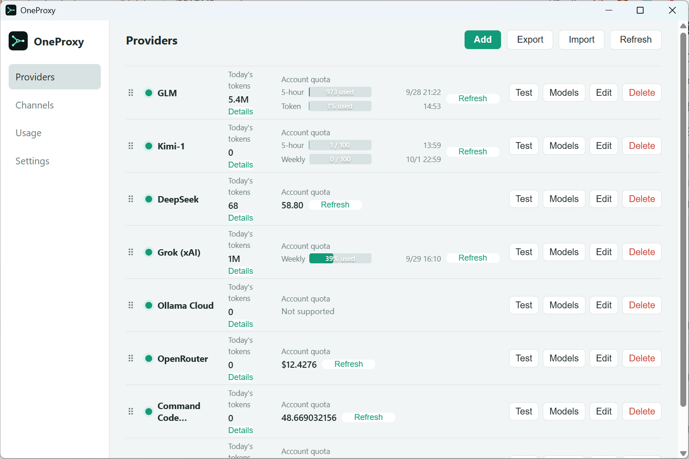

# OneProxy

[简体中文](README.md) | English

Manage multiple AI provider accounts in one desktop app and connect your clients through a single local endpoint. Made for people who use both subscription plans and pay-as-you-go APIs.

## Features

- **Manage providers in one place:** Presets for z.ai, BigModel, Kimi, MiniMax, DeepSeek, OpenRouter, Grok, Ollama Cloud, and more, plus custom compatible services. Test connections, browse models, check supported account quotas, and import or export provider settings.
- **Organize models into channels:** Connect one client-facing model to multiple provider accounts. Choose priority-based fallback or weighted distribution.
- **Switch automatically:** When an upstream account is rate-limited or unavailable, try another available account.
- **Track usage:** See today's tokens and account quotas on the Providers page, and review usage by channel and provider.
- **Connect familiar clients:** Use Anthropic, OpenAI Chat, or OpenAI Responses compatible endpoints. Copy client connection details from Settings.
- **Use it on your desktop:** Switch between Chinese and English or light and dark themes. Reopen the app from the system tray after closing its window.

## Providers and models

OneProxy does not limit clients to one model provider. These are **upstream model examples included in the current presets**. If an upstream service supports model listing, you can browse its models on the Providers page and enter an available model when creating a channel.

| Provider preset | Upstream model example |
| --- | --- |
| z.ai Coding Plan, BigModel Coding Plan | `glm-5.3` |
| Kimi Coding plan | `kimi-for-coding` |
| Kimi Open Platform, Kimi International | `kimi-k3` |
| MiniMax Token Plan | `MiniMax-M3` |
| DeepSeek | `deepseek-chat` |
| Grok (xAI) | `grok-4.5` |
| OpenRouter | `openai/gpt-5.2` and other models available to your account |
| [OpenCode Zen](https://opencode.ai/docs/zen) | `deepseek-v4-flash`, `minimax-m3`, `glm-5.3`, `kimi-k3` |
| [Command Code (OpenAI)](https://commandcode.ai/docs/provider) | `deepseek/deepseek-v4-flash`, `deepseek/deepseek-v4-pro` |
| [Command Code (Anthropic)](https://commandcode.ai/docs/provider) | `claude-sonnet-4-6`, `claude-opus-5` |
| [Ollama Cloud](https://ollama.com/blog/cloud-models) | `qwen3-coder:480b-cloud`, `gpt-oss:120b-cloud`, `gpt-oss:20b-cloud` |
| Custom compatible service (such as a local Ollama endpoint) | `qwen3:32b`, `llama3.3:70b`, `mistral:7b`, where offered by the connected service |

A channel can map a client-facing model name to different upstream models. For example, you can bind `claude-sonnet-4-6` to both `glm-5.3` and `kimi-k3`: the client keeps one model name while OneProxy chooses an account and switches when needed. Here, `claude-sonnet-4-6` is a client-facing name; it does not mean OneProxy provides a Claude model or subscription.

These are examples, not a guarantee that every account can use them. Check each provider's current model list and supported endpoint.

## Download and use

Download the desktop app for your system from [Releases](../../releases). Add an account under **Providers**, bind a model under **Channels**, then copy the client connection details from **Settings**.

### Connect a client

The client BASE_URL must include a channel ID (see the **Channels** page; ready-to-copy connection details are on the **Settings** page):

- Anthropic API (Claude Code, etc.): `http://127.0.0.1:8280/<channel-id>` — the client appends `/v1/messages` itself
- OpenAI API (Chat and Responses): `http://127.0.0.1:8280/<channel-id>/v1`

Requests without a channel ID fail with HTTP 400. Use the local proxy key from **Settings** as the API key.

| Platform | Download file |
| --- | --- |
| Windows x64 | `OneProxy-*-windows-amd64.exe` |
| Windows ARM64 | `OneProxy-*-windows-arm64.exe` |
| macOS Intel | `OneProxy-*-darwin-amd64.app.zip` |
| macOS Apple Silicon | `OneProxy-*-darwin-arm64.app.zip` |

> Quota checks depend on the provider. Some services require a separate key for quota queries.
