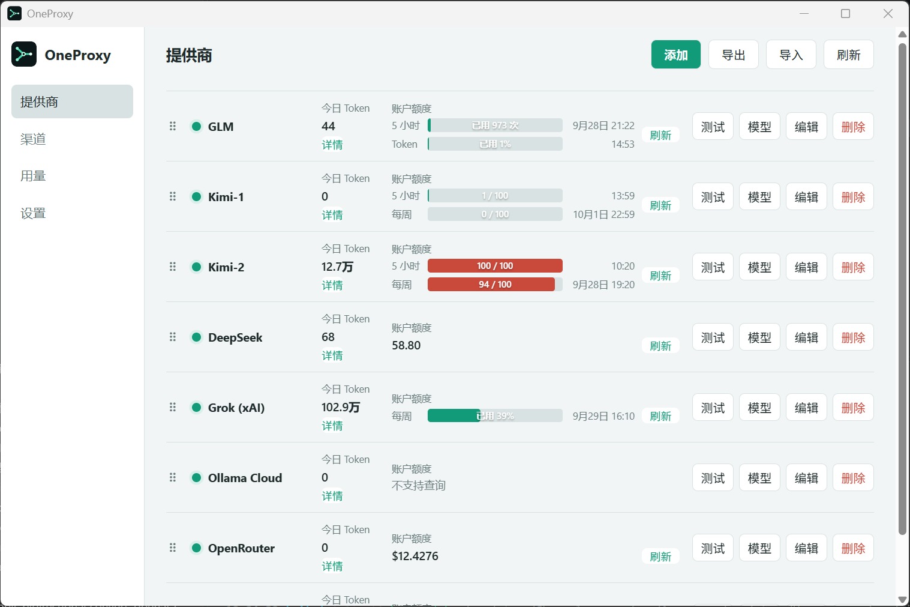

# OneProxy

简体中文 | [English](README.en.md)

把多个 AI 服务账户放在一起管理，让不同客户端通过同一个本地入口使用。适合同时使用订阅套餐和按量付费 API 的个人用户。

## 功能

- **统一管理提供商**：内置 z.ai、智谱 BigModel、Kimi、MiniMax、DeepSeek、OpenRouter、Grok、Ollama Cloud 等预设，也能添加自定义兼容服务。可测试连接、查看模型、查询支持的账户额度，并导入或导出提供商配置。
- **按渠道组织模型**：一个对外模型可绑定多个提供商账户；按优先级安排主备，或按权重分配请求。
- **自动切换**：遇到限流或上游不可用时，尝试其他可用账户，减少手动换号。
- **查看用量**：在提供商页查看今日 Token 和账户额度，在用量页查看渠道与提供商的使用记录。
- **接入常用客户端**：提供 Anthropic、OpenAI Chat 和 OpenAI Responses 兼容入口；设置页可直接复制客户端连接信息。
- **桌面使用**：支持中文、英文和深浅色主题；关闭窗口后可从系统托盘重新打开。

## 支持的提供商与模型

OneProxy 不限定客户端只能使用某一家模型。下表是当前内置预设给出的**上游模型示例**；如果上游支持模型查询，添加账户后可在「提供商」查看模型，并在「渠道」中填写实际可用的模型名。

| 提供商预设 | 上游模型示例 |
| --- | --- |
| z.ai Coding Plan、智谱 BigModel Coding Plan | `glm-5.3` |
| Kimi Coding 套餐 | `kimi-for-coding` |
| Kimi 开放平台、Kimi 国际站 | `kimi-k3` |
| MiniMax Token Plan | `MiniMax-M3` |
| DeepSeek | `deepseek-chat` |
| Grok (xAI) | `grok-4.5` |
| OpenRouter | `openai/gpt-5.2` 等账户可用模型 |
| [OpenCode Zen](https://opencode.ai/docs/zen) | `deepseek-v4-flash`、`minimax-m3`、`glm-5.3`、`kimi-k3` |
| [Command Code（OpenAI）](https://commandcode.ai/docs/provider) | `deepseek/deepseek-v4-flash`、`deepseek/deepseek-v4-pro` |
| [Command Code（Anthropic）](https://commandcode.ai/docs/provider) | `claude-sonnet-4-6`、`claude-opus-5` |
| [Ollama Cloud](https://ollama.com/blog/cloud-models) | `qwen3-coder:480b-cloud`、`gpt-oss:120b-cloud`、`gpt-oss:20b-cloud` |
| 自定义兼容服务（如连接本地 Ollama） | `qwen3:32b`、`llama3.3:70b`、`mistral:7b` 等；以所连服务实际提供的模型 ID 为准 |

渠道可以把客户端使用的模型名映射到不同的上游模型。例如，把 `claude-sonnet-4-6` 分别绑定到 `glm-5.3` 和 `kimi-k3`，客户端仍使用同一个模型名，OneProxy 负责选择账户和切换。这里的 `claude-sonnet-4-6` 是对外模型名，并不表示 OneProxy 提供 Claude 模型或订阅。

以上都是示例，不代表所有账户都有权限使用；具体模型和接口以提供商当前开放的列表为准。

## 下载与使用

从 [Releases](../../releases) 下载适合系统的桌面程序。打开后，在「提供商」添加账户，再到「渠道」绑定要使用的模型；最后到「设置」复制客户端连接信息。

| 平台 | 下载文件 |
| --- | --- |
| Windows x64 | `OneProxy-*-windows-amd64.exe` |
| Windows ARM64 | `OneProxy-*-windows-arm64.exe` |
| macOS Intel | `OneProxy-*-darwin-amd64.app.zip` |
| macOS Apple Silicon | `OneProxy-*-darwin-arm64.app.zip` |

> 账户额度是否可查询取决于提供商；部分服务需单独填写额度查询密钥。
